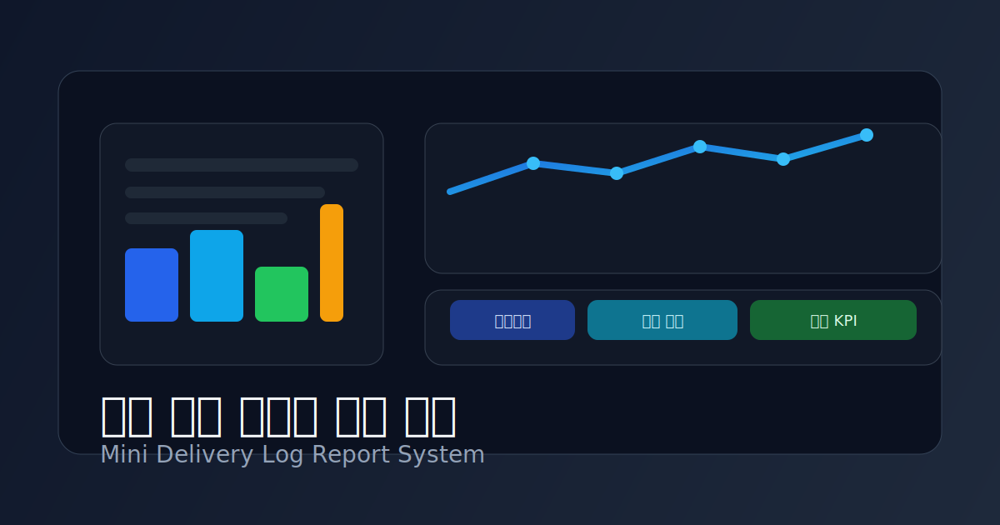

# 배달 주문 이벤트 로그 분석 미니 프로젝트



배달의민족(배민) 스타일의 **배달 주문 이벤트 로그를 분석하여  
리드타임, 병목 구간, 운영 KPI를 산출하는 미니 프로젝트**입니다.

본 프로젝트는 **순수 JavaScript**로 구현되며,  
실제 서비스 환경을 단순화한 **가상 이벤트 로그 데이터**를 사용합니다.

---

## 📌 프로젝트 목표

-   주문 이벤트 로그 기반으로 **주문 타임라인 복원**
-   배달 과정의 **구간별 리드타임 및 병목 구간 분석**
-   운영 의사결정에 활용 가능한 **KPI 산출 및 시각화**

자세한 목표 정의는 아래 문서를 참고하세요.  
👉 [`docs/overview.md`](./docs/overview.md)

---

## 📂 문서 구조 안내

본 프로젝트의 핵심 설계 문서는 `docs/` 디렉토리에 정리되어 있습니다.

### 1. 프로젝트 개요

-   **Overview**
    -   프로젝트 목적, 문제 정의, 목표, 범위
    -   👉 [`docs/overview.md`](./docs/overview.md)

---

### 2. KPI 정의

-   **KPI Definition**
    -   배달 리드타임, 지연율, 병목 구간 등 KPI 정의
    -   KPI 계산 기준 및 활용 목적
    -   👉 [`docs/kpi-definition.md`](./docs/kpi-definition.md)

---

### 3. 데이터 스키마

-   **Data Schema**
    -   이벤트 로그(`event_log`) 구조 정의
    -   이벤트 타입 및 필드 설명
    -   KPI 계산과의 연결 관계
    -   👉 [`docs/data-schema.md`](./docs/data-schema.md)

---

### 4. 이벤트 로그 생성 규칙

-   **Event Log Generation Rules**
    -   샘플 데이터 자동 생성 규칙
    -   지연 시나리오, 이벤트 누락/중복/순서 오류 정의
    -   👉 [`docs/event-log-generation.md`](./docs/event-log-generation.md)

---

### 5. 데이터 처리 파이프라인

-   **Data Processing Pipeline**
    -   이벤트 로그 → KPI 결과까지의 처리 흐름
    -   단계별 책임 분리 및 설계 의도
    -   👉 [`docs/pipeline.md`](./docs/pipeline.md)

---

## 🧩 프로젝트 구조 (예정)

```text
src/
 ├─ loader/        # 이벤트 로그 로드
 ├─ core/          # 타임라인 복원, 리드타임 계산, KPI 집계
 ├─ utils/         # 공통 유틸 함수
 └─ index.js       # 파이프라인 실행 진입점

docs/
 ├─ overview.md
 ├─ kpi-definition.md
 ├─ data-schema.md
 ├─ event-log-generation.md
 └─ pipeline.md
```

## 🚀 진행 순서

1. 프로젝트 목표 정의 (Overview)
2. KPI 정의 (KPI Definition)
3. 데이터 스키마 확정 (Data Schema)
4. 이벤트 로그 샘플 데이터 생성 (Event Log Generation)
5. 데이터 처리 파이프라인 구현 (Pipeline)
6. KPI 결과 시각화 및 리포트 구성

## 🛠 기술 스택

-   Language: JavaScript (ES6+)
-   Runtime: Node.js
-   Data Format: JSONL, CSV
-   Visualization: Web 기반 대시보드 (확장 예정)

---

## 🌐 GitHub Pages 배포

GitHub Actions를 통해 정적 대시보드를 자동 배포할 수 있습니다.

1. 저장소 **Settings → Pages → Build and deployment**에서 Source를 **GitHub Actions**로 설정
2. 기본 브랜치(`main`)에 push
3. Actions의 `Deploy dashboard to GitHub Pages` 워크플로우 완료 후 Pages URL 접속

### 로컬 빌드

```bash
npm run build
```

빌드가 완료되면 `dist/` 폴더에 아래 파일이 생성됩니다.

- `dist/index.html`
- `dist/kpi.json`

`index.html`은 같은 경로의 `kpi.json`을 자동으로 로드하며, 실패 시 파일 업로드로 직접 확인할 수 있습니다.
